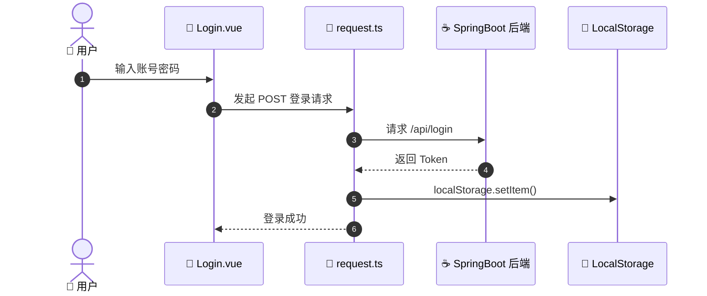

# 🎨 学生信息管理系统 - 前端工程（student_client）

本项目是学生信息管理系统的现代化前端工程，基于 **Vite + Vue 3 + TypeScript** 架构搭建。全站遵循 **Material Design 3** 视觉规范，引入 **ECharts 6** 提供专业级数据可视化大屏。

---

# ✨ 核心视觉与功能亮点

- **Material Design 3 极致重构**: 全面适配 MD3 规范，建立了标准的三级灰阶背景体系（`#000000 / #1C1C1E / #2C2C2E`），确保深色模式拥有极致的物理纵深感。
- **数字化分析大屏**: 新增 `/dashboard` 页面，实时展示历年成绩趋势、及格率波动、专业占比、以及基于标准差算法的课程难度雷达图。
- **Excel 全链路集成**: 学生、课程、成绩三大模块全面支持“下载模板 -> 格式引导（带图标悬停提示） -> 批量导入 -> 一键导出”的闭环操作。
- **毛玻璃与沉浸式体验**: 顶栏集成 `backdrop-filter` 模糊特效，配合骨架屏加载、路由滑入滑出动效、以及纯正暗黑模式切换。
- **交互逻辑增强**: 
  - **成绩录入**: 支持百分制实时预览学分换算，自动防呆校验。
  - **快捷交互**: 登录页支持 `Enter` 键焦点自动切换与快捷登录。
  - **详细介绍页**: 首页卡片支持点击下钻，通过折叠面板展示各模块核心技术架构。

---

# 📂 核心目录结构
```text
student_client/
├── src/
│   ├── api/                # Axios 封装与业务 API 接口
│   ├── assets/             # 静态资源(Logo/图标)
│   ├── components/         # 复用组件
│   ├── router/             # Vue Router 路由守卫与映射
│   ├── types/              # TypeScript 全局接口定义
│   ├── views/              # 业务页面(Student/Dashboard/Intro)
│   ├── App.vue             # 根组件(动画过渡配置)
│   ├── main.ts             # 入口文件(挂载全局样式)
│   └── style.css           # 🎨 全局 Material Design 3 样式
├── public/                 # 公共静态资源
├── index.html              # SPA 挂载主页
└── vite.config.ts          # Vite 构建与服务配置
```

---

# 🚀 页面进度看板 (Frontend Status)
- [x] **登录门户**: 快捷键适配、暗黑模式适配
- [x] **首页大厅**: 业务特性介绍页、数据统计预览
- [x] **分析大屏**: ECharts 6 多维动态分析、自适应布局
- [x] **学生管理**: 头像全栈上传、Excel 批量互操作、分页 CRUD
- [x] **课程管理**: Excel 批量互操作、学分动态绑定
- [x] **成绩录入**: 学分自动折算预览、Excel 批量导入导出、多表关联展示
- [x] **404 兜底**: 全局异常页面适配


------

# 🛠️ 一、本地开发环境依赖

在运行本项目前，请确保您的本地电脑已安装好以下环境：

- **Node.js**：`v18.x` 或更高版本（内置 `npm`）
- **推荐 IDE**
  - `WebStorm`
  - `VS Code`（推荐安装 `Volar` 插件）

------

# 🚀 二、克隆后的快速配置与运行

## 📦 步骤 1：安装项目依赖

由于工程配置了严格的 `.gitignore` 规则，庞大的 `node_modules` 依赖目录未上传至云端。

克隆项目后，请在前端根目录执行：

```bash
# 使用 npm 安装全套开发依赖
npm install
```

执行完成后，本地会自动生成：

```text
node_modules
```

目录。

------

## ⚙️ 步骤 2：检查 TypeScript 环境配置

本项目启用了严格的：

```json
verbatimModuleSyntax
```

类型安全检测。

如果编辑器出现类型报错，请确保根目录下存在：

```text
env.d.ts
```

该文件负责为：

```text
.vue
```

单文件组件提供 TypeScript 类型声明。

------

### ⚠️ 纯类型导入规范

纯类型导入必须严格遵循：

```ts
import type { AxiosResponse } from 'axios'
```

规范。

避免将类型与运行时代码混合导入，否则 TypeScript 编译器可能出现报错。

------

## ▶️ 步骤 3：启动开发环境

请确保 Java 后端服务（`8080` 端口）已启动。

在前端根目录执行：

```bash
npm run dev
```

终端输出启动链接后：

- 按住 `Ctrl`
- 点击链接

默认访问地址：

```text
http://localhost:5173
```

即可在浏览器中打开系统。

------

# 📁 三、核心代码目录结构

为保持良好的：

- 代码组织
- 模块解耦
- 工程规整度

建议遵循以下目录结构进行开发：

```text
src/
├── api/
│   └── request.ts
│       # Axios 请求拦截器
│       # （统一注入 Token 与拦截异常码）
│
├── views/
│   ├── Login.vue
│   │   # 登录页
│   │
│   ├── Layout.vue
│   │   # 后台主框架
│   │   # （侧边栏、头部导航、路由出口）
│   │
│   ├── Student.vue
│   │   # 学生管理模块
│   │   # （CRUD、分页、搜索、表单校验）
│   │
│   └── Course.vue
│       # 课程管理模块
│       # （支持完整 CRUD）
│
├── types/
│   └── index.ts
│       # TypeScript 类型定义
│
├── router/
│   └── index.ts
│       # Vue Router 路由配置
│       # （含 beforeEach 登录守卫）
│
├── main.ts
│   # 前端入口文件
│   # （全局注入 Element Plus）
│
└── env.d.ts
    # Vue 环境声明文件
```

------

# ⚡ 四、Windows 环境专属：全栈极速通关

如果前后端位于同级目录，并已配置好数据库环境，则无需手动打开 IDEA 或 WebStorm。

------

## ▶️ start.bat（一键开工）

双击：

```text
start.bat
```

即可自动拉起：

- `8080` 后端服务
- `5173` 前端服务

实现：

> 一键全栈启动

------

## 🛑 stop.bat（一键收工）

双击：

```text
stop.bat
```

即可：

- 安全关闭端口进程
- 清理后台服务占用
- 防止端口冲突

有效避免：

- 第二次启动失败
- 端口占用
- 僵尸进程残留

等常见开发期问题。

------

# 📦 五、前端技术栈总览

本项目当前采用如下核心技术栈：

| 技术         | 作用                 |
| ------------ | -------------------- |
| Vue 3        | 前端核心框架         |
| TypeScript   | 类型安全与工程化开发 |
| Vite         | 极速构建工具         |
| Element Plus | 企业级 UI 组件库     |
| Axios        | HTTP 请求工具        |
| Vue Router   | 页面路由管理         |
| LocalStorage | Token 本地缓存       |

------

# 🔐 六、登录鉴权机制说明

系统登录流程如下：



------

# 🧠 七、开发规范建议

## ✅ 推荐 Git Commit 规范

建议采用如下格式：

```bash
feat: 新增登录页
fix: 修复 token 丢失问题
style: 调整页面布局
refactor: 重构 request.ts
```

------

## ✅ 推荐模块拆分原则

- 页面放 `views`
- 网络请求放 `api`
- 公共组件放 `components`
- 工具函数放 `utils`
- 路由配置放 `router`

保持：

> 单模块职责单一原则

避免后期代码结构混乱。

------
