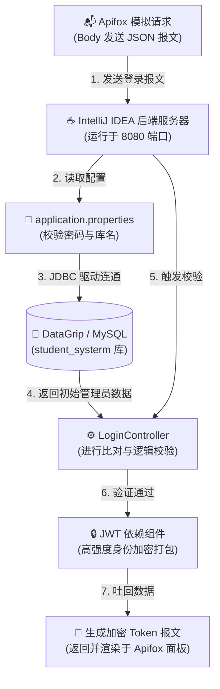

# 📝 学生信息管理系统 - Day 1 全栈开发深度复盘与工具链总结

本篇文档用于记录项目第一天（Day 1）的研发路线、核心操作细节以及全栈开发工具链的底层运行机制。

---

## 📊 一、 全景数据流向图 (Data Flow)

### 📊 附录：Day 1 底层数据流向图



## 💾 二、 数据库战线复盘（DataGrip 核心操作与底层作用）

第一天的核心是搭建项目的“数据地基”，通过 DataGrip 客户端完成了从 MySQL 软件服务到具体业务表结构的层层递进。

### 1. 核心操作细节
* **创建自定义架构（新建 → 架构 / New → Schema）**：
    * *底层作用*：在 MySQL 软件服务大楼中独立申请开辟了一个名为 `student_systerm` 的**独立虚拟房间**。它与电脑中原有的“博客网站”数据库处于同一物理端口（`3306`）下，但相互逻辑隔离，**从根本上避免了端口冲突和脏数据污染**。
* **轰入全套 DDL 脚本与级联外键约束（`ON DELETE CASCADE`）**：
    * *底层作用*：在库中标准化建立了用户表（`user`）、学生表（`student`）、课程表（`course`）和成绩表（`score`）。在 `score` 表中通过外键关联了学生和课程的主键 ID，并配置了**级联删除（Cascade）**。这意味着未来一旦在学生表中删除某学生，其在成绩表中的历史分数会自动被系统抹去，**确保了多表关联时数据的完整性与一致性**。
* **调出隐藏的 `4/6` 架构过滤**：
    * *底层作用*：顺应了 DataGrip 客户端的视图过滤机制，将未勾选的 `student_systerm` 取消隐藏。同时在列表中认识了 MySQL 底层自带的 4 个系统管家（如 `sys`、`information_schema` 等，用于监控 SQL 性能和登记元数据），将其保持默认状态，不做任何篡改。

---

## ☕ 三、 后端战线复盘（IntelliJ IDEA 核心操作与底层作用）

后端的任务是快速搭建高可用的 MVC 架构，并编写出全系统核心的安全守门接口。

### 1. 核心操作细节
* **使用 Spring Initializr 脚手架一键初始化**：
    * *底层作用*：快速召唤出符合企业级规范的 Spring Boot 项目骨架，自动配置好 Maven 依赖管理目录结构，免去了手动组装底层环境的繁琐。
* **精密勾选四大神兵利器（依赖组件）**：
    * `Spring Web`：提供内嵌式 Tomcat 服务器，赋予项目开门营业、接收前端 HTTP 请求的能力。
    * `MySQL Driver`：提供 Java 语言连接 MySQL 数据库的官方标准通讯驱动。
    * `MyBatis Framework`：封装底层的 JDBC 操作，让 Java 对象能够与数据库表进行优雅地映射与交互。
    * `Lombok`：通过注解在编译期动态生成 Getter/Setter/ToString 代码，属于高效编写干净实体的偷懒神器。
* **配置 `application.properties` 文件拉起网线**：
    * *底层作用*：将本地 MySQL 的 `root` 管理员密码、端口、时区（`serverTimezone=GMT%2B8`）及精准的库名 `student_systerm` 注入 Spring 容器。点击运行后，项目顺利在 `8080` 端口通电启动。
* **引入 `java-jwt` 并编写 `LoginController`**：
    * *底层作用*：在 `controller` 包下构建了 `POST /api/login` 路由。当接收到前端发来的 JSON 载荷后，进行逻辑比对。验证通过后，利用算法（`Algorithm.HMAC256`）将用户信息、过期时间打包装入一串高强度加密的 **Token 字符串**中返回，**为明天的前端鉴权和后天的拦截器开发提供了全局通行证**。

---

## 📡 四、 接口战线复盘（Apifox 联动测试）

前后端分离开发中，接口测试工具扮演着“前端浏览器页面”的角色，是研发闭环的质检员。

### 1. 核心操作细节
* **安装 `Apifox Helper` 插件一键无缝映射**：
    * *底层作用*：打通了研发环境与测试环境的直连壁垒。通过在 IDEA 中右键类名点击 `Upload to Apifox`，利用 API Token 将后端的 Java 代码注解自动解析并瞬间同步到 Apifox 云端，省去了繁琐的手动录入参数过程。
* **在 Apifox 客户端中点击“发送（Send）”测试**：
    * *底层作用*：**成功完成 Day 1 全栈联调闭环！** 模拟客户端向 `http://localhost:8080/api/login` 发起真实的 POST 请求，后端拦截、校验并成功在响应体（Response）中吐回标准的 `code: 200`、成功提示以及密密麻麻的 Token。

---

## 🛠️ 五、 今日核心踩坑防呆笔记 (Bug Logging)

### 📌 坑位：文件名与公共类名不匹配（编译期标红）
* **错误现象**：代码中书写完 `public class LoginController` 后，整行遭遇 IDEA 傲娇地抛出红色下划线，项目拒绝编译。

* **诱发原因**：手滑在创建 Java 文件时，将文件名误拼写为了 `LoginContorller.java`（`o` 和 `r` 的字母顺序颠倒），而代码内公共类名为 `LoginController`。**Java 规范严格铁律：用 `public` 修饰的类名必须与物理磁盘上的文件名百分之百严格契合。**

* **重构一键解决**：无需删除。在左侧目录树选中该拼错的文件，按下 IDEA 黄金重构快捷键 **`Shift + F6` (Rename)**，将其文件名一键纠正为 `LoginController.java`，红线瞬间消退，项目恢复正常编译。

  # 📝 学生信息管理系统 - Day 2 前端战线攻坚与前后端胜利会师

  本篇文档用于记录项目第二天（Day 2）在 WebStorm 中的前端工程化搭建、TypeScript 严苛语法填坑、跨域限制打破以及工程自动化脚本的部署。

  ---

  ## 📊 一、 全栈技术闭环看板 (Milestones)

  今天系统成功实现了前后端“两军会师”，打通了从前端表单到浏览器本地缓存（LocalStorage）的完整链路：

  ```mermaid
  graph LR
      View["🎨 Login.vue (Element Plus 表单)"]
      Axios["📡 request.ts (Axios 拦截器)"]
      CORS["🔓 @CrossOrigin (Java 跨域放行)"]
      Storage["💾 LocalStorage (浏览器大抽屉)"]
  
      View -->|1. 提交 admin/123456| Axios
      Axios -->|2. 强攻 8080 端口| CORS
      CORS -->|3. 后端验正通过并颁发 Token| Axios
      Axios -->|4. localStorage.setItem| Storage

## 🎨 二、 前端战线复盘（WebStorm 核心操作与底层作用）

前端工程架构采用主流的 **Vite + Vue3 + TypeScript** 组合，彻底告别了传统的面条式代码，实现了模块化管理。

### 1. 核心操作细节

- **使用 Vite 独立初始化毛坯房工程**：

  - *底层作用*：将前端工程 `student_client` 与后端 `student-server` 放置于同级目录下，**保持目录独立，严防前后端依赖大乱套、代码乱打包的惨案发生**。

- **引入三大神兵利器（Element Plus、Axios、Vue Router）**：

  - *底层作用*：Element Plus 负责提供高颜值后台组件；Axios 负责充当外交官建立网络通信；Vue Router 负责后续的整站页面路由调度。

- **封装带“通行证功能”的 Axios 拦截器 (`request.ts`)**：

  - *底层作用*：响应考核文档规范。**请求拦截器**实现了每次发请求前自动去 `localStorage` 里搜寻 Token，一旦找到，无缝塞入 Headers 中（格式：`Authorization: Bearer <Token>`）；**响应拦截器**实现了对后端状态码的统一过滤，拦截异常并利用 `ElMessage` 弹出全局警报。

- **在 `main.ts` 中全局注入组件库样式**：

  - *底层作用*：解决了浏览器不认识 `<el-input>` 等自定义标签导致的“页面一片空白、家具无法显形”的经典新手坑，让 UI 组件全盘通电。

    ## 🛠️ 三、 工程自动化与环境提效

    针对多端软件频繁启闭的痛点，在根目录下编写了全栈自动化批处理脚本，大幅压降了环境调试的时间成本。

    ### 1. 工程目录拓扑

    Plaintext

    ```
    D:\SchoolProject\ (总项目大工程文件夹)
      ├── start.bat  (一键开工：无需打开 IDEA/WebStorm 即可双击拉起前后端服务)
      └── stop.bat   (一键收工：精准重拳强杀 8080 和 5173 端口，严防端口冲突)
    ```

    ------

    ## 📝 四、 今日硬核踩坑日记 (Bug Logging)

    作为全栈研发人员，今日遇到的 3 个极具代表性的技术痛点及解决方案如下：

    ### 📌 坑位 1：TS1484 独立模块严格纯类型导入报错

    - **错误现象**：在 `request.ts` 中引入 `InternalAxiosRequestConfig` 等配置时，TS 编译器疯狂亮红灯。
    - **诱发原因**：Vite 模板默认启用了 `verbatimModuleSyntax` 严苛语法。在 TS 编译成 JS 最终打包时，类型声明会被全部擦除。不加区分地混在一起导入，打包工具会产生困惑。
    - **重构解决**：将普通代码导入与纯类型导入彻底分家，在类型前强制追加 **`import type`** 关键字，红线瞬间熄灭。

    ### 📌 坑位 2：TS7016 隐式 any 警告（TS 不认得 `.vue` 文件）

    - **错误现象**：在 `main.ts` 中引入根组件 `App.vue` 时，TS 傲娇提示找不到该模块的声明文件。
    - **诱发原因**：TypeScript 默认只具备识别 `.ts` 文件的视力，对于 Vue 独创的 `.vue` 单文件组件直接视而不见。
    - **重构解决**：在 `src` 根目录下紧急配置 **`env.d.ts` 环境类型声明文件**作为翻译官，明确告诉 TS 编译器将其视为标准的 `DefineComponent` 模块对待。

    ### 📌 坑位 3：联调时遭遇浏览器的“跨域安全拦截 (CORS)”

    - **错误现象**：点击登录按钮后，前端捕获网络失败，Element Plus 在屏幕上无限放大了“灰色大叉号”。
    - **诱发原因**：由于前端处于 `5173` 端口，后端处于 `8080` 端口，协议/域名/端口任一不同，即触发了浏览器的**同源安全保护策略**，严禁跨域通信。
    - **重构解决**：切回 Java 后端，在 `LoginController` 类头顶重磅加冕 **`@CrossOrigin`** 通关注解，允许 5173 端口跨域通信。重启服务后，两军顺利会师，Token 成功锁入 LocalStorage！

    ------

    ## 🚀 五、 GitHub 云端备份固化

    - **成果**：借助 **GitHub Desktop** 客户端，在本地安全初始化仓库，精密配置了 `.gitignore` 忽略文件（成功拦截了几百兆的 `node_modules` 和 `target` 垃圾碎文件）。
    - **同步**：已将 `student-server` 与 `student_client` 分别作为两个独立的规范仓库成功 Publish 到 GitHub 云端，完成了全套源码的线上固化备份。